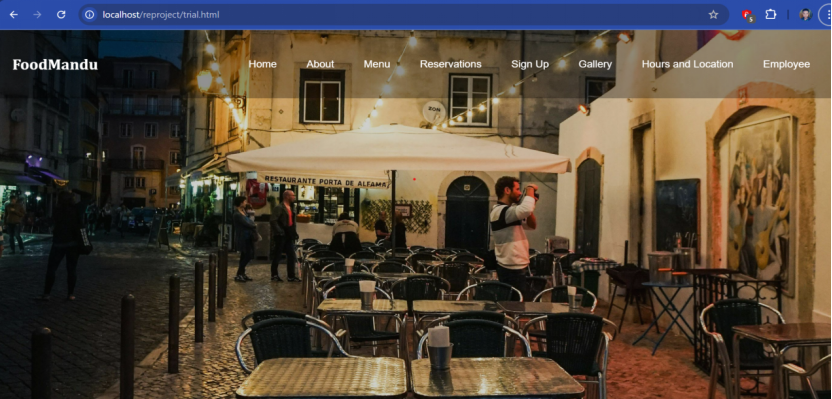
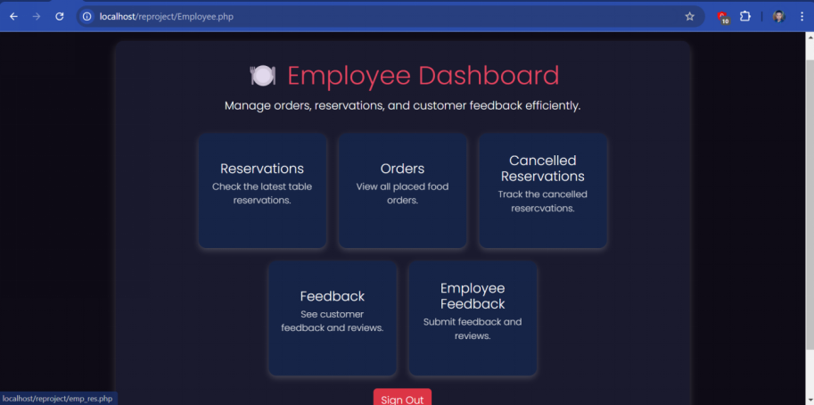
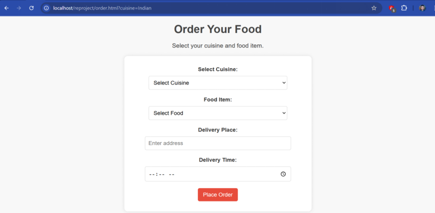

# smart-ordering-and-billing

Smart website for efficient restaurant ordering and billing.
<br>
Using PHP, HTML, CSS, and MySQL.

# 🍽️ FoodMandu – Restaurant Management System

FoodMandu is a web-based restaurant management system developed using PHP, HTML, and CSS. It allows restaurants to manage customer reservations, user authentication, and more via a user-friendly interface.

Open your browser and navigate to:
http://localhost/FoodMandu – Restaurant Management System/


🧑‍💻 Technologies Used
PHP
HTML5
CSS3

🖼️ Screenshots
1. Home
   

2. Admin Dashboard
   

3. Booking page
   

🧑‍💻 Technologies Used
PHP
HTML5
CSS3
MySQL (if database is used)

## 🌟 Features

- 🔐 User Sign-Up & Authentication
- 📅 Reservation Management
- ❌ Cancel Reservations
- 📄 About Page
- 🎨 Custom CSS Styling for Each Page

## 📁 Project Structure

```plaintext
├── About.html
├── auth.php
├── foodmandu_signup.html
├── foodmandu_signup.php
├── cancel-reservation.php
├── *.css (various stylesheets)


🛠️ Installation
Clone this repository or download the ZIP.
Place the project folder in your web server's root directory (e.g., htdocs for XAMPP).
Start Apache and MySQL using XAMPP or any other local server.
Import the database if provided (.sql file may be inside project; check folder).


🛠️ Installation
Clone this repository or download the ZIP.
Place the project folder in your web server's root directory (e.g., htdocs for XAMPP).
Start Apache and MySQL using XAMPP or any other local server.
Import the database if provided (.sql file may be inside project; check folder).

